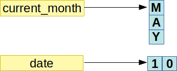
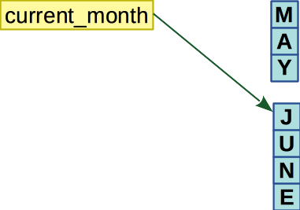
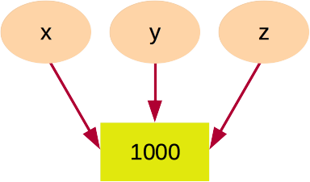
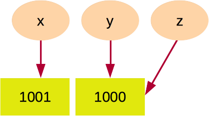
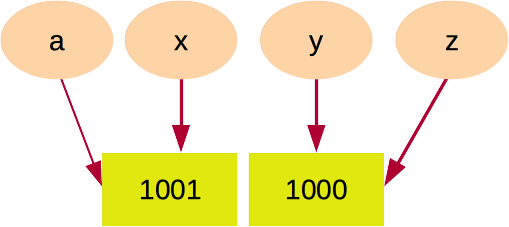

## Python Identifiers aka Variables

In Python, variable names are kind of tags/pointers to the memory location which hosts the data. We can also think of it as a labeled container that can store a **single value**. That single value can be of practically any data type.

### Storing Values in Variables:

In Python, the declaration & assignation of value to the variable are done at the same time, i.e. as soon as we assign a value to a non-existing or existing variable, the required memory location is assigned to it and proper data is populated in it.

> **NOTE**: Storing Values in Python is one of the most important concepts and should be understood with great care. 


```python
current_month = "MAY"
print(current_month)
```

    MAY


In the above example, `current_month` is the variable name and "MAY" is the value associated with it. Operation performed in the first line is called `assignment` and such statements are called `assignment statements`. Lets discuss them in details.

#### Assignment Statements
You’ll store values in variables with an assignment statement. An assignment statement consists of a variable name, an equal sign (called the assignment operator), and the value to be stored. If you enter the assignment statement current_month = "MAY", then a variable named `current_month` will be pointing to a memory location which has the string value "MAY" stored in it.

> In Python, we do not need to declare variable explicitly. They are declared automatically when any value is assigned. The assignment is done using the equal (`=`) operator as shown in the below example:


```python
current_month = "MAY" # A comment.
date = 10
```

The pictorial representation of variables from above example.


Now lets perform some actions on the variable `current_month` and observe the changes happening on it. 

In the example shown below, we will reassign a new value `JUNE` to the variable `current_month` and observe the effects of it. 

Image below shows the process of re-assignation. You will note that a new memory is assigned to the variable instead of using the existing one.


```python
current_month = "JUNE"
```



`current_month` was initially pointing to memory location containing value `MAY` and after reassination, it was pointing to a **new** memory location containing value `JUNE` and if no other referencing the previous value, then automatically Python GC will clean it at some future time.


```python
next_month = "JUNE"
print(next_month, id(next_month))
```

    JUNE 4497409072


> **Note:** That value of June has not updated but a new memory was allocated for value `July` and variable now points to it.


```python
### More than one variables can point to the same memory location.

cm = "MAY"
current_month = cm
print(current_month, cm)
```

    MAY MAY


```python
print(id(cm), id(current_month))
```

    4497316400 4497316400


```python
current_month = "June"
print(current_month)
```

    June


```python
print(id(cm), id(current_month))
```

    4497316400 4494439408


```python
current_month = cm
print(id(cm), id(current_month))
```

    4497316400 4497316400


 Later in the chapter, we will show the above senario with more examples.


```python
current_month = "May"
print(id(current_month))
next_month = "JUNE"
print(id(next_month), next_month)
current_month = "JUNE"
print(id(current_month), current_month)
```

    4475427376
    4497409072 JUNE
    4497409072 JUNE


### How to find the reference count of a value


```python
########## Reference count ###################
# NOTE: Please test the below code by saving 
#       it as a file and executing it instead
#       of running it here.
#############################################
import sys

new_var = "JUNE"
print(sys.getrefcount(new_var))
```

    4


> **NOTE**:

> The value of refcount will almost always be more than you think. It is done internally by python to optimize the code. I will be adding more details about it in "Section 2 -> Chapter: GC & Cleanup"

### Multiple Assignment:
In multiple assignment, multiple variables are assigned values in a single line. There are two ways multiple assignment can be done in python. In first format all the variables point to the same value and in next all variables point to individual values. 

#### 1. Assigning single value to multiple variables:


```python
x = y = z = 1000

print(x, y, z)
```

    1000 1000 1000


In the above example, all x, y and z are pointing to same memory location which contains 1000, which we are able to identify by checking the `id` of the variables. They are pointing to the same memory location, thus value of `id` for all three are same. 


```python
print(x, id(x))
print(y, id(y))
print(z, id(z))
```

    1000 4496834448
    1000 4496834448
    1000 4496834448




Now, lets change value of one variable and again check respective `id`es.


```python
x = x + 1

print(x, id(x))
print(y, id(y))
print(z, id(z))
```

    1001 4497436912
    1000 4496834448
    1000 4496834448





```python
a = x
print(a, id(a))
print(x, id(x))
print(y, id(y))
print(z, id(z))
```

    1001 4497436912
    1001 4497436912
    1000 4496834448
    1000 4496834448




Now, lets test something else. Can different data types impact the behavior of python memory optimization. We will first test it with integer, string and then with list.  


```python
### INTEGER 
x = 1000
y = 1000
z = 1000
```


```python
print("x =", x, "id(x) =", id(x))
print("y =", y, "id(y) =", id(y))
print("z =", z, "id(z) =", id(z))
```

    x = 1000 id(x) = 4497437040
    y = 1000 id(y) = 4497437200
    z = 1000 id(z) = 4497436752


```python
### INTEGER 
x = 1000
y = x
z = y
# same as: x = y = z = 1000

print("x =", x, "id(x) =", id(x))
print("y =", y, "id(y) =", id(y))
print("z =", z, "id(z) =", id(z))
```

    x = 1000 id(x) = 4497437168
    y = 1000 id(y) = 4497437168
    z = 1000 id(z) = 4497437168


> **Special Case**: For integers ranging from -5 to 256


```python
### INTEGER 
x = 24
y = 24
z = 24
```


```python
print("x =", x, "id(x) =", id(x))
print("y =", y, "id(y) =", id(y))
print("z =", z, "id(z) =", id(z))
```

    x = 24 id(x) = 4460150288
    y = 24 id(y) = 4460150288
    z = 24 id(z) = 4460150288


```python
x = 24
y = 24
z = 24  

x = x + 1
a = 25
```


```python
print("x =", x, "id(x) =", id(x))
print("a =", a, "id(a) =", id(a))
print("y =", y, "id(y) =", id(y))
print("z =", z, "id(z) =", id(z))
```

    x = 25 id(x) = 4460150320
    a = 25 id(a) = 4460150320
    y = 24 id(y) = 4460150288
    z = 24 id(z) = 4460150288


```python
### String
x = "1000"
y = 1000
z = "1000"  
```


```python
print("x =", x)  
print("y =", y) 
print("z =", z)  

print("id(x) =", id(x))
print("id(y) =", id(y))
print("id(z) =", id(z))
```

    x = 1000
    y = 1000
    z = 1000
    id(x) = 4497523312
    id(y) = 4496833936
    id(z) = 4497523312


check the id of both x and z, they are same but y is not same.


```python
### list
x = ["1000"]
y = [1000]
z = ["1000"]  
a = [1000]
print(x)  
print(y) 
print(z)  
print(a)  
print(id(x))
print(id(y))
print(id(z))
print(id(a))
```

    ['1000']
    [1000]
    ['1000']
    [1000]
    4497455776
    4497272336
    4496418688
    4497455696


#### 2. Assigning multiple values to multiple variables:


```python
x, y, z = "Kind", "Ja", 10
```


```python
print("x =", x)  
print("y =", y) 
print("z =", z)  

print("id(x) =", id(x))
print("id(y) =", id(y))
print("id(z) =", id(z))
```

    x = Kind
    y = Ja
    z = 10
    id(x) = 4497532976
    id(y) = 4497532144
    id(z) = 4460149840


```python
# More variables less values.
try:
    x, y, z = 10, 120
except Exception as e:
    print(e)
```

    not enough values to unpack (expected 3, got 2)


```python
# Less variables More values.
try:
    x, y, z = 10, 120, 29, 30
except Exception as e:
    print(e)
```

    too many values to unpack (expected 3)


```python
# Valid variable name but **not recommended**.

ସ୍ବାଗତ = "Welcome"
print(ସ୍ବାଗତ)
```

    Welcome


```python
# Python variable are case sensitive

Welcome = "আদৰণি"
welcome = "आईं ना"
wElcome = "স্বাগতম"
print(Welcome, welcome, wElcome)
print(id(Welcome), id(welcome), id(wElcome))
```

    আদৰণি आईं ना স্বাগতম
    4497210896 4497496976 4497443024


### Variable Names & Naming Conventions

There are a couple of naming conventions in use in Python:
- lower_with_underscores: Uses only lower case letters and connects multiple words with underscores.
- UPPER_WITH_UNDERSCORES: Uses only upper case letters and connects multiple words with underscores.
- CapitalWords: Capitalize the beginning of each letter in a word; no underscores.

With these conventions in mind, here are the naming conventions in use.

* Variable Names: lower_with_underscores
* Constants: UPPER_WITH_UNDERSCORES
* Function Names: lower_with_underscores
* Function Parameters: lower_with_underscores
* Class Names: CapitalWords
* Method Names: lower_with_underscores
* Method Parameters and Variables: lower_with_underscores
* Always use `self` as the first parameter to a method
* To indicate privacy, precede name with a single underscore.

Options can be used to override the default regular expression associated to each type. The table below lists the types, their associated options, and their default regular expressions.

|        Type       |         Default Expression        |
|:-----------------:|:-----------------------------------------:|
|      Argument     | [a-z\_][a-z0-9\_]                    |
|     Attribute     | [a-z\_][a-z0-9\_]                    |
|       Class       | [A-Z\_][a-zA-Z0-9]                       |
|      Constant     | [A-Z\_][A-Z0-9\_]                   |
|      Function     | [a-z\_][a-z0-9\_]                    |
|       Method      | [a-z\_][a-z0-9\_]                    |
|       Module      | (([a-z\_][a-z0-9\_]), ([A-Z][a-zA-Z0-9])) |
|      Variable     | [a-z\_][a-z0-9\_]                    |


```python
pm_name = "Narendra Modi"
prime_minister = "Narendra Modi"
cong_p_name = "Rahul Gandhi"
correct_name_of_congress_president = "Rahul Gandhi"
congress_president = "Rahul Gandhi"
cname = "RG"
```

Please find the invalid variables name from the below list

```python
this_is_my_number
THIS_IS_MY_NUMBER 
ThisIsMyNumber
this_is_number 
anotherVarible
This1
this1home
1This
__sd__
__sub domain__
_sd
_sub@domain
```

### Good Variable Name

- Choose meaningful name instead of short name. `roll_no` is better than `rn`.
- Maintain the length of a variable name. `Roll_no_of_a_student` is too long?
- Be consistent; `roll_num` or `RollNo` or `rollno` or `rollNo`
- Begin a variable name with an underscore(_) character for a special case.


`_` is used 
* To use as ‘Internationalization(i18n)’ or ‘Localization(l10n)’ functions.
* To act as a dump variable which can be used for data which are of no use. 

## Exercises

Q 1. Find the valid and in-valid variable names from the followings:

* balance
* current-balance 
* current balance 
* current_balance 
* 4account 
* _spam 
* 42 
* SPAM 
* total_$um 
* account4 
* 'hello'  
* ସ୍ବାଗତ

Q 2. **Multiple Choice Questions & Answers**

- Is Python case sensitive when dealing with identifiers?
```
a) yes
b) no
c) machine dependent
d) none of the mentioned
```
- What is the maximum possible length of an identifier?
```
a) 31 characters
b) 63 characters
c) 79 characters
d) none of the mentioned
```
-  What does local variable names beginning with an underscore mean?
```
a) they are used to indicate a private variables of a class
b) they confuse the interpreter
c) they are used to indicate global variables
d) None of the 
```
- Which of the following is true for variable names in Python?
```
a) unlimited length
b) Only _ and $ special characters allowed in variable name
c) private members should have leading & trailing underscores
d) None of the above
```

Q 3: **Good Code / Bad Code**: Find if the code in question will run or not ( with error message)

- 
```python
test1 = 101
test2 = "Arya Sharma"
test3 = test1 + test2
```

