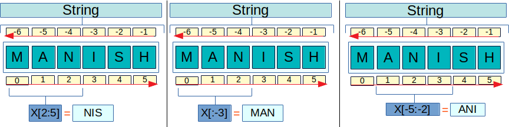

## Slices

*Slices* of *strings* can be obtained by adding indexes between brackets after a  *string* or any other iterable object.



**Syntax** 

```python
<collection>[start: end + 1: step]
```
**Example**


```python
name = "Manish"
print(name[1:2])
```

    a


```python
print(name[::])
```

    Manish


### Python indexes:
-------

(when Step is +ve)
+ Default Start is first element in sequnce **order**.
+ Count from the end if they are negative.
+ Can be defined as sections, in the form `[start: end + 1: step]`. If not set the start, it will be considered as zero. If not set end + 1, it will be considered the size of the object. The step (between characters), if not set, is 1.

> **!!! TIP !!!**: 
It is possible to invert *strings* or other iterable data type by using a negative step:


```python
p = "Manish Gupta"
print(p[2: -1: 2])
```

    ns ut


```python
p = "Manish Gupta"
print(p[2::-2])
```

    nM


```python
p = "Manish Gupta"
print(p[:3: -2])
```

    apGh


```python
p = "Manish Gupta"
print(p[::-3])
```

    auhn


```python
print(p[1:4])
```

    ani


```python
print(p[-5:-1])
```

    Gupt


```python
st = "Python Templates"
print(st[0::-2])
```

    P


```python
st = "Python Templates"
print(st[10:2])
```

    


- **Effects of -ve steps**


```python
print(st[::-2])
```

    stlmTnhy


> NOTE:
><br/>
> If start and end indexes are not provided, then we tarverse from the last element to first element


```python
## Gotcha 
st = "Manish Gupta is Genius"
print(st[2:8:-2])
```

    


```python
## Gotcha 
st = "Python Templates"
print(st[:4:-2])
print(st[:3:-2])
```

    stlmTn
    stlmTn


```python
print(st[8:2:-2])
```

    e o


```python
# Funny Case, it creates a new string with reversed order.
st = "Manish Gupta is Genius"
print(st[::-1])
```

    suineG si atpuG hsinaM


We can even assign the values to variables as shown below


```python
rev = st[::-1]

print(rev, id(rev), id(st))
```

    suineG si atpuG hsinaM 4413727168 4413708688


```python
rev = st[8::-2]
t = ""
print(">{rev}<".format(rev=rev), id(rev), id(t), id(None))
```

    >u snM< 4413726256 4377566448 4375982168


```python
rev = st[8:2:-2]
print(rev)
```

    u s


```python
print("implemented"[5:7:-2])
```

    


```python
print("implemented"[::-2])
print("implemented"[-5::-2])
print("implemented"[:-7:-2])
```

    dteepi
    eepi
    dte


```python
print("implemented"[::2])
print("implemented"[1::2])
print("implemented"[1:4:2]) 
```

    ipeetd
    mlmne
    ml


```python
str1="Guten Tag"
print(str1[1:])
print(str1[-1:])
print(str1[-2:4])
print(str1[-4:-2])
print(str1[-1:2:-1])
print(str1[4])
```

    uten Tag
    g
    
     T
    gaT ne
    n


> ?1 -> starts from i(**m**) and ends


```python
x = 10
print(id(x))
x = "Mayank Johri"
print(x)
print("id(x)",id(x))
print("x[0:]", id(x[0:]))
print(id(x[1:]))
print(id(x[2:]))
print(x[0:])
print(x[1:])
print(x[2])

x = "God knows"
print(x)
print(id(x))
print(id(x[0]))
print(id(x[1]))
print(id(x[2]))
print(x[0])
print(x[1])
print(x[2])
```

    4376284240
    Mayank Johri
    id(x) 4413725680
    x[0:] 4413725680
    4388083824
    4413663920
    Mayank Johri
    ayank Johri
    y
    God knows
    4413725232
    4378922032
    4378644848
    4378478448
    G
    o
    d


```python
lst = [1, 3, 4, 5, 6, 7, 8, 9, 10, 11]

print(lst[-3: 1: -1])
```

    [9, 8, 7, 6, 5, 4]


### Changing List using slicing

Slicing allows to add/update/remove the elements from a list as shown below

#### Adding/Extending elements in existing list 


```python
lst = [1, 3, 4, 5]
lst_new_users =  [11, 10, 9, 8, 7]

# instead of insert + Extend I can use slicing also.
lst[1:1] = lst_new_users
print(lst)
```

    [1, 11, 10, 9, 8, 7, 3, 4, 5]


```python
lst = [1, 3, 4, 5]
lst_new_users =  [11, 10, 9, 8, 7]

# instead of insert + Extend I can use slicing also.
lst[2:2] = lst_new_users
print(lst)
```

    [1, 3, 11, 10, 9, 8, 7, 4, 5]


#### appending elements of list


```python
lst = [1, 2, 3, 4, 5]

lst[1:4] = [234]
print(lst)
```

    [1, 234, 5]


In the above example, elements with index value 1, 2 & 3 were removed and '234' was inserted in their place 


```python
# Even index element replacing

lst = [1, 3, 4, 5, 6, 7]

print(lst)
print(lst[::2])
lst[::2] = [11, 10, 12]
print(lst)
```

    [1, 3, 4, 5, 6, 7]
    [1, 4, 6]
    [11, 3, 10, 5, 12, 7]


```python
# Odd indexed elements
lst = [1, 2, 3, 4, 5]
lst[1::2] = [20, 40]
print(lst)
```

    [1, 20, 3, 40, 5]


#### Removing elements of list


```python
lst = [1, 2, 3, 4, 5]
del(lst[1:4])
print(lst)
```

    [1, 5]


In the above example, elements with index value 1, 2 & 3 were removed using `del` keyword


```python
lst = [1, 2, 3, 4, 5]

lst[1:4] = []
print(lst)
```

    [1, 5]


In the above example, elements with index value 1, 2 & 3 were removed using `[]`
