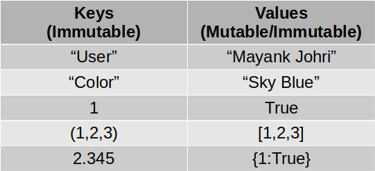

## Dictionary

A dictionary is a list of associations composed by a unique key and corresponding structures. Dictionaries are mutable, like lists.

The key must be an immutable type, usually strings, but can also be tuples or numeric types. On the other hand the items of dictionaries can be either mutable or immutable. The Python dictionary provides no guarantee that the keys are ordered.

Syntax:
```python
dictionary = {'a': a, 'b': b, ..., 'z': z}
```
Structure:



Example of a dictionary:


```python
brands = {'name': 'Dabar', 'product': 'Honey'}
```

- Acessing elements:


```python
print(brands['name'])
```

    Dabar


```python
# Trying to access a key which do not exists

try:
    print(brands['Blabla'])
except Exception as e:
    print("Error", e)
```

    Error 'Blabla'


- Adding/Updating elements:

If the key is not present than key/value pair will be created else, existing value will be updated. 
```python
brands['key_1'] = '120'
```

- Removing one elemento from a dictionary:
```python
del brands['key_1']
```


Getting the items, keys and values:
```python
items = brands.items()
keys = brands.keys()
values = brands.values()
```

**Examples with dictionaries**:


```python
brands = {'name': 'Dabar', 'brand': 'Honey'}

items = brands.items()
keys = brands.keys()
values = brands.values()

print(items)
print(keys)
print(values)
```

    dict_items([('name', 'Dabar'), ('brand', 'Honey')])
    dict_keys(['name', 'brand'])
    dict_values(['Dabar', 'Honey'])


```python
# using tupple as key :)
# All elements of tupple should be immutable. 

my_ci = {(1,2,3): "Welcome", (2,3,4): 'Kind'}
print(my_ci[(1,2,3)])
```

    Welcome


### Multiple values with same key 

Last key/value pair will retain its value and all previous instances of key/value will be overwritten by the last pair. 


```python
## !!! Gotcha's !!!

dic = {'name': 'Dabar', 'name': 'Dabar New', 'product': 'Honey'}
print(dic)
print(len(dic))
```

    {'name': 'Dabar New', 'product': 'Honey'}
    2


> **NOTE**: 
> the latest one will override the previous key/values as shown in the above example

### Dictonary with `for` loop


```python
progs = {
    "India": "Chennai",
    "South Africa": "Sant Petersberg",
    "England": "London"
}
```

#### keys


```python
# only keys will be returned. 
for a in progs:
    print(a)
```

    India
    South Africa
    England


```python
# The above code is equivalent to this

for a in progs.keys():
    print(a)
```

    India
    South Africa
    England


```python
print("Keys \t=> Values")
for a in progs.keys():
    print("{key} => {val}".format(key=a, val=progs[a]))
```

    Keys 	=> Values
    India => Chennai
    South Africa => Sant Petersberg
    England => London


```python
print("Keys \t=> Values")
for a in progs:
    print("{key}\t=> {val}".format(key=a, val=progs[a]))
```

    Keys 	=> Values
    India	=> Chennai
    South Africa	=> Sant Petersberg
    England	=> London


#### `items` 


```python
for key, val in progs.items():
    print(key, val)
```

    India Chennai
    South Africa Sant Petersberg
    England London


#### values

> **NOTE**: You can/should not get `keys` from  `values`, because values can be duplicate. 


```python
for val in progs.values():
    print(val)
```

    Chennai
    Sant Petersberg
    London


```python
progs = {
    "India": "Chennai",
    "South Africa": "Sant Petersberg",
    "England": "London"
}

# More progs
progs['Bangaladesh'] = "Dhaka"

print(progs)
```

    {'India': 'Chennai', 'South Africa': 'Sant Petersberg', 'England': 'London', 'Bangaladesh': 'Dhaka'}


### Delete a key/value pair


```python
##### Why its failing
progs = {'India': 'Chennai', 'South Africa': 'Sant Petersberg', 'England': 'London', 'Bangaladesh': 'Dhaka'}
print(progs)

del progs["England"]
print(progs)
```

    {'India': 'Chennai', 'South Africa': 'Sant Petersberg', 'England': 'London', 'Bangaladesh': 'Dhaka'}
    {'India': 'Chennai', 'South Africa': 'Sant Petersberg', 'Bangaladesh': 'Dhaka'}


### Nested Dictionary


```python
multid = {'school': 'DMS',
          'students_details': {
              1001: {
                  "name": "Mayank",
                  "age": 43
              },
              1002: {
                  "name" : "Vishal Saxena",
                  "age": 43
              },
              1003: {
                  "name": "Rajeev Chaturvedi",
                  "age": 41
              }
          }
        }

print(multid)
```

    {'school': 'DMS', 'students_details': {1001: {'name': 'Mayank', 'age': 43}, 1002: {'name': 'Vishal Saxena', 'age': 43}, 1003: {'name': 'Rajeev Chaturvedi', 'age': 41}}}


```python
print(multid['students_details'][1001])
print(multid['students_details'][1002]['name'])
```

    {'name': 'Mayank', 'age': 43}
    Vishal Saxena


### Handling non existing `keys` 


```python
progs = {
    "India": "Chennai",
    "South Africa": "Sant Petersberg",
    "England": "London"
}

try:
    print(progs["Nepal"])
except KeyError:
    print("Error: Key now found")
```

    Error: Key now found


```python
if "Nepal" in progs:
    print("Hello")
else:
    print("Key not found")
```

    Key not found


```python
if "India" in progs:
    print("Hello:", progs["India"])
else:
    print("Key not found")
```

    Hello: Chennai


we can use `get` attribute of `dictionary` to get the values as shown in the below example. In this example, we will be returned with default set value if no key is found. In below case it will return value `NonExistingKey` 


```python
print(progs.get("Nepal", "NonExistingKey"))
```

    NonExistingKey


### More dictionary Examples.


```python
multid = {'school': 'DMS',
          'students_details': {
              "students": 
                  [
                      "Mayank",
                      "Vishal",
                      "Rajeev"
                  ]
          }}
print(multid)
```

    {'school': 'DMS', 'students_details': {'students': ['Mayank', 'Vishal', 'Rajeev']}}


```python
# traversing with duplicate keys

dupli = {
    "meme" : "mjmj",
    "test" : "TESt value",
    "meme" : "wewe"
}

print(dupli)
for k in dupli:
    print(k)
```

    {'meme': 'wewe', 'test': 'TESt value'}
    meme
    test


```python
# # Matrix in form of string
# matrix = '''0 0 0 0 0 0 0 0 0 0 0 0
# 9 0 0 0 0 0 0 0 0 0 0 0
# 0 0 0 0 0 0 0 0 0 4 0 0
# 0 0 0 0 0 0 0 3 0 0 0 0
# 0 0 0 0 0 0 5 0 0 0 0 0
# 0 0 0 0 6 0 0 0 0 0 0 0'''

# mat = {}

# # split the matrix in lines
# for row, line in enumerate(matrix.splitlines()):

#     # Splits the line int cols
#     for col, column in enumerate(line.split()):

#         column = int(column)
#         # Places the column in the result,
#         # if it is differente from zero
#         if column:
#             mat[row, col] = column

# print (mat)
# # The counting starts with zero
# print ('Complete matrix size:', (row + 1) * (col + 1))
# print ('Sparse matrix size:', len(mat))
```

### Creating dictionary, continued.

> **NOTE**: One can create dictionary using the following methods as well


```python
# dictionary = dict(key1=value1, key2=value2, ...)

names = dict(mayank="johri", Ashwini="Johri", Rahul="Johri")
print(names)
```

    {'mayank': 'johri', 'Ashwini': 'Johri', 'Rahul': 'Johri'}


```python
# !!! Gotcha !!!
# It will fail to handle complex data type as keys

    names = dict(("mayank", "test")="johri", ashwini="johri", Rahul="Johri")
    print(names)
```
Output:
```
  File "<ipython-input-15-bd2bbfe31949>", line 3
    names = dict(("mayank", "test")="johri", ashwini="johri", Rahul="Johri")
                ^
SyntaxError: keyword can't be an expression

```


```python
# dictionary = dict([(key1, value1), (key2, value2), ...])

names = dict([("mayank","johri"), ("ashwini", "johri"), ("Rahul","Johri")])
print(names)
```

    {'mayank': 'johri', 'ashwini': 'johri', 'Rahul': 'Johri'}


```python
# It can handle tuples as key also
names = dict([(("mayank", "test"),"johri"), ("ashwini", "johri"), ("Rahul","Johri")])
print(names)
```

    {('mayank', 'test'): 'johri', 'ashwini': 'johri', 'Rahul': 'Johri'}


```python
# Less keys than values
lst_keys = ['mayank', 'roshan', 'GV', 'kv_pauly']
lst_vals = ['100', '10000', '10000', '20000', '99999']

ke_va = dict(zip(lst_keys, lst_vals))
print(ke_va)
```

    {'mayank': '100', 'roshan': '10000', 'GV': '10000', 'kv_pauly': '20000'}


```python
# more keys than value
lst_keys = ['kv_pauly', 'roshan', 'GV', 'mayank']
lst_vals = ['33300', '10000', '10000']

ke_va = dict(zip(lst_keys, lst_vals))
print(ke_va)
```

    {'kv_pauly': '33300', 'roshan': '10000', 'GV': '10000'}


```python
# !!! Very bad idea !!!

from itertools import zip_longest as zipl

lst_keys = ['mayank', 'roshan', 'GV', 'kv_pauly']
lst_vals = ['100', '10000', '10000', '20000', '99999', 299]

ke_va = dict(zipl(lst_keys, lst_vals, fillvalue=0))
print(ke_va)

## Note that missing 0/99999 key_value pair. 
```

    {'mayank': '100', 'roshan': '10000', 'GV': '10000', 'kv_pauly': '20000', 0: 299}


```python
from itertools import zip_longest as zipl
lst_keys = ['mayank', 'roshan', 'GV', 'kv_pauly', "Dr. Ashiwini", "Rahul"]
lst_vals = ['100', '10000', '10000']

ke_va = dict(zipl(lst_keys, lst_vals, fillvalue=[200, 200]))
print(ke_va)
```

    {'mayank': '100', 'roshan': '10000', 'GV': '10000', 'kv_pauly': [200, 200], 'Dr. Ashiwini': [200, 200], 'Rahul': [200, 200]}


```python
from itertools import zip_longest as zipl
lst_keys = ['mayank', 'roshan', 'GV', 'kv_pauly', "Dr. Ashiwini"]
lst_vals = ['100', '10000', '10000']
x = 100

def popu():
    print("inside popu...")
    global x
    x = x +1
    return x

ke_va = dict(zipl(lst_keys, lst_vals, fillvalue=popu()))
print(ke_va)
```

    inside popu...
    {'mayank': '100', 'roshan': '10000', 'GV': '10000', 'kv_pauly': 101, 'Dr. Ashiwini': 101}


There are few more methods to create a dictionary which will be covered in `functional programming`.


Lets check below two examples and see what is happening


```python
# Blank Dictionary

d = dict()

d_blank = {}
```


```python
# lets populate the dictionary

d[10.1] = "TEST"
d[10] = "test"  
d[10.5] = "really testing"
d[20] = "Testing completed"

print(d)
```

    {10.1: 'TEST', 10: 'test', 10.5: 'really testing', 20: 'Testing completed'}


```python
d = dict()
lst = [(10.0, "TEST"), (22, "tt"), (33, "trtr")]

for key, val in lst:
    d[key] = val
print(d)
```

    {10.0: 'TEST', 22: 'tt', 33: 'trtr'}


```python
# non functional way to populate the dictionary

lst1 = [1, 2, 3, 4, 5]
lst2 = ["a", "b", "c", "d", "f"]
# Another way to create a blank dictionary

alf = {}
for i, val in enumerate(lst1):
    alf[val] = lst2[i]
    
print(alf)
```

    {1: 'a', 2: 'b', 3: 'c', 4: 'd', 5: 'f'}


We can use the above method if 
- both the lists are of same size.
- list which contains the keys should not have mutable object. 

> **NOTE**: We need to declare dictionary before we can use it. It can be a blank dictionary also 

### Joining two dictionaries


```python
a = {1: 'a', 2: 'b', 3: 'c', 4: 'd', 5: 'f'}
b = {10.0: 'TEST', 22: 'tt', 33: 'trtr'}

try:
    c = a + b
    print(c)
except TypeError as te:
    print(te)
```

    unsupported operand type(s) for +: 'dict' and 'dict'


```python
# !! Gotcha !! non working try !!!!
a = {1: 'a', 2: 'b', 3: 'c', 4: 'd', 5: 'f'}
b = {10.0: 'TEST', 22: 'tt', 33: 'trtr'}

c = a

for x in b:
    c[x] = b[x]
print(a)
print(b)
print(c)
```

    {1: 'a', 2: 'b', 3: 'c', 4: 'd', 5: 'f', 10.0: 'TEST', 22: 'tt', 33: 'trtr'}
    {10.0: 'TEST', 22: 'tt', 33: 'trtr'}
    {1: 'a', 2: 'b', 3: 'c', 4: 'd', 5: 'f', 10.0: 'TEST', 22: 'tt', 33: 'trtr'}


```python
# working try, but needs optimization

a = {1:['a', [2]], 2: 'b', 3: 'c', 4: 'd', 5: 'f'}
b = {10.0: 'TEST', 22: 'tt', 33: 'trtr'}

c = {}
for x in a:
    c[x] = a[x]
    
for x in b:
    c[x] = b[x]
    
print(a)
print(b)
print(c)
```

    {1: ['a', [2]], 2: 'b', 3: 'c', 4: 'd', 5: 'f'}
    {10.0: 'TEST', 22: 'tt', 33: 'trtr'}
    {1: ['a', [2]], 2: 'b', 3: 'c', 4: 'd', 5: 'f', 10.0: 'TEST', 22: 'tt', 33: 'trtr'}


```python
# Optimization try 1

def dict_copy(src, dest):
    for x in src:
        dest[x] = src[x]
       
c = {}
dict_copy(a, c)
dict_copy(b, c)
print(a)
print(b)
print(c)
```

    {1: ['a', [2]], 2: 'b', 3: 'c', 4: 'd', 5: 'f'}
    {10.0: 'TEST', 22: 'tt', 33: 'trtr'}
    {1: ['a', [2]], 2: 'b', 3: 'c', 4: 'd', 5: 'f', 10.0: 'TEST', 22: 'tt', 33: 'trtr'}


```python
# Lets check for deep and shallow copy
print(id(a[1]), id(c[1]))
# So its a shallow copy
```

    4567550944 4567550944


```python
# !! Best method :) !!
a = {1: 'a', 2: 'b', 3: 'c', 4: 'd', 5: 'f'}
b = {10.0: 'TEST', 22: 'tt', 33: 'trtr', 2: "testing"}

c = {**a, **b}
print(a)
print(b)
print(c)
```

    {1: 'a', 2: 'b', 3: 'c', 4: 'd', 5: 'f'}
    {10.0: 'TEST', 22: 'tt', 33: 'trtr', 2: 'testing'}
    {1: 'a', 2: 'testing', 3: 'c', 4: 'd', 5: 'f', 10.0: 'TEST', 22: 'tt', 33: 'trtr'}


### Dictionary Gocha's

- Same Numeric values keys  


```python
d = dict()

# lets populate the dictionary

d[10]= "really testing"
d[10.0]

print(d)
```

    {10: 'really testing'}


> **NOTE**: Dictionaries are implemented with a hash table and hash of 10.0 and 10 are same, thus  10.0 and 10 keys of dict are same and only one key/value pair is shown for them. Please check the url for details.   
> - https://stackoverflow.com/questions/32209155/why-can-a-floating-point-dictionary-key-overwrite-an-integer-key-with-the-same-v/32211042#32211042


```python
print(hash(10.0) == hash(10))
print(hash(10.0), hash(10))
print(10.0 == 10)
```

    True
    10 10
    True


```python
print(hash("10.0"), hash(10))
```

    -2421610822030493224 10

