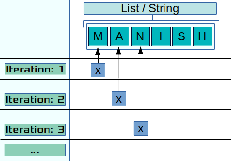

# Loops
----

During the course of solving client requirements, comes across situations where group of some data needs to be processed against a defined set of instructions. 

Loops help in resolving situations where a piece of code needs to be executed against a set of data repetitedly or till certain condition is met or un-met. Or, you use to process a large quantity of data, such as lines of a file or records of a database that must be processed by the same code block.

Python provides two constructs to help in these situations.

- `for`
- `while`

Lets start with the `for` loops.

## For

It is one of the most often used construct in Python. It can accept not only accept static sequences, but also sequences generated by iterators (Structures which allow iterations, i.e. sequentially access to collection of elements). It runs the code block against known iterations of dataset.

The syntax for `for` is as follows:

**Syntax**:
```python
for <reference> in <sequence/iterable data>:
    <code block>
    continue
    break
    pass
else:
    <code block>
```

During the execution of a *for* loop, the reference points to an element in the sequence. At each iteration, the reference is updated, in order for the *for* code block to process the corresponding element.

The clause *break* stops the loop and *continue* passes it to the next iteration. The code inside the `else` is executed at the end of the loop, except if the loop has been interrupted by *break*.

Example:


```python
for x in "Mr. Manish Gupta":
    print(x, end=" ")
print(".")
```

    M r .   M a n i s h   G u p t a .




In the above example, "Mr. Manish Gupta" is a sequence of characters and for loop traverse that sequence of characters. Also you will note that we are ending the print statement with space instead of new line using the option `end=`. 

Similarly in the below example we are going to use the `range` function to generate the sequence of numbers starting from 30 and ending with 5 with difference of 5. 

### The `range()` kind of a function

The `range(m, n, p)`, is very useful in loops, as it returns a list of integers starting at `m` through smaller than `n` in steps of length `p`, which can be used as the order for the loop.

We can also define the start, stop and step size as `range(start, stop + 1, step size)`. step size defaults to 1 if not provided.

We can generate a sequence of numbers using range() function. range(10) will generate numbers from 0 to 9 (10 numbers).


This function does not store all the values in memory, it would be inefficient. So it remembers the start, stop, step size and generates the next number on the go.

To force this function to output all the items, we can use the function list().


```python
# Output: range(0, 10)
print(range(10))
```

    range(0, 10)


```python
# Output: [0, 1, 2, 3, 4, 5, 6, 7, 8, 9]
print(list(range(10)))
```

    [0, 1, 2, 3, 4, 5, 6, 7, 8, 9]


```python
# Output: [2, 3, 4, 5, 6, 7]
print(list(range(2, 8)))
```

    [2, 3, 4, 5, 6, 7]


```python
# Output: [2, 5, 8, 11, 14, 17]
print(list(range(2, 20, 3)))
```

    [2, 5, 8, 11, 14, 17]


```python
print(list(range(20, 2, -3)))
```

    [20, 17, 14, 11, 8, 5]


```python
list(range(30, 1, -5))
```


    [30, 25, 20, 15, 10, 5]


```python
s = 0
for x in range(30, 1, -5):
    s = s + x
    print(x, "=>", s)

print("sum of 30 to 1 with steps -5 is", s)
```

    30 => 30
    25 => 55
    20 => 75
    15 => 90
    10 => 100
    5 => 105
    sum of 30 to 1 with steps -5 is 105


`s = s + x` can also be expressed as `s += x`


```python
# Sum 0 to 99
s = 0
for x in range(30, 1, -5):
    s += x
    print(x, "=>", s)

print("Sum of 30 to 1 with steps -5 is", s, 
      "and the last number was:", x)
```

    30 => 30
    25 => 55
    20 => 75
    15 => 90
    10 => 100
    5 => 105
    Sum of 30 to 1 with steps -5 is 105 and the last number was: 5


```python
# Sum 0 to 99
s = 0
for x in range(100):
    s += x
print("sum of 0 to 99 is", s)
```

    sum of 0 to 99 is 4950


### Nested loops

We can also have nested `for` loops as shown in the below example


```python
for x in range(1, 6):
    for y in range(1, x+1):
        print(x, y)
    print("~^"*10)
```

    1 1
    ~^~^~^~^~^~^~^~^~^~^
    2 1
    2 2
    ~^~^~^~^~^~^~^~^~^~^
    3 1
    3 2
    3 3
    ~^~^~^~^~^~^~^~^~^~^
    4 1
    4 2
    4 3
    4 4
    ~^~^~^~^~^~^~^~^~^~^
    5 1
    5 2
    5 3
    5 4
    5 5
    ~^~^~^~^~^~^~^~^~^~^


> NOTE: Please avoid below case


```python
## !!! Gotcha !!!: Using same variable for inner and outer loop
for x in range(1, 6):
    for x in range(1, x+1):
        print(x, x)
```

    1 1
    1 1
    2 2
    1 1
    2 2
    3 3
    1 1
    2 2
    3 3
    4 4
    1 1
    2 2
    3 3
    4 4
    5 5


```python
# This is better, x should not be repeated
for x in range(1, 6):
    for a in range(1, x+1):
        print(x, a)
```

    1 1
    2 1
    2 2
    3 1
    3 2
    3 3
    4 1
    4 2
    4 3
    4 4
    5 1
    5 2
    5 3
    5 4
    5 5


### `for` loop with a list

- Order of elements are maintained while iteration.


```python
# again order is maintained. 
cols = ["Red", "Green", "Yellow", "White"]

for color in cols:
    print(color)
```

    Red
    Green
    Yellow
    White


```python
cols = ["Red", "Green", "Yellow", "White"]

for color in cols:
    print(color)
else:
    print(" ~~~~ Done ~~~~")
```

    Red
    Green
    Yellow
    White
     ~~~~ Done ~~~~


```python
# Advance code, to be used after learning slicing. Please use instead the other code
for x in "Manish Gupta"[::-1]:
    print(x, end=" ")
```

    a t p u G   h s i n a M 


```python
# Never ever use it. BAD Code
reverse_text = ""
for char in "Manish Gupta":
    reverse_text = char + reverse_text
    print(f"> {char} - {reverse_text}")
print(reverse_text)
```

    > M - M
    > a - aM
    > n - naM
    > i - inaM
    > s - sinaM
    > h - hsinaM
    >   -  hsinaM
    > G - G hsinaM
    > u - uG hsinaM
    > p - puG hsinaM
    > t - tpuG hsinaM
    > a - atpuG hsinaM
    atpuG hsinaM


we can also have conditions where multiple values are returned every iteration. lets take the below case, were we have list of lists and inner list has fixed numbers of elements (in our case 2)


```python
x_test = [[1, 2], [3, 4], [5, 6]]

try:
    for x in x_test:
        print (x[0], x[1])
except Exception as e:
    print("Error Message:", e)
```

    1 2
    3 4
    5 6


```python
plot_cord = [[1, 2], [3, 4], [5, 6]]

for x_cord, y_cord in plot_cord:
    print(x_cord, y_cord)
```

    1 2
    3 4
    5 6


```python
x_test = [[1, 2], [3, 4], [5, 6], [1]]

try:
    for x in x_test:
        print (x[0], x[1])
except Exception as e:
    print("Error Message:", e)
```

    1 2
    3 4
    5 6
    Error Message: list index out of range


```python
# Scenario 1: Less number of elements in sublist
plot_cord = [[1, 2], [3, 4], [5, 6], [1]]

try:
    for x_cord, y_cord in plot_cord:
        print(x_cord, y_cord)
except Exception as e:
    print("Error Message:", e)
```

    1 2
    3 4
    5 6
    Error Message: not enough values to unpack (expected 2, got 1)


```python
# Scenario 2: more number of elements in sublist
x_test = [[1, 2], [3, 4], [5, 6], [1, 2, 3]]

try:
    for x, y in x_test:
        print(x, y)
except Exception as e:
    print("Error Message:", e)
```

    1 2
    3 4
    5 6
    Error Message: too many values to unpack (expected 2)


```python
x_test = [[1, 2], [3, 4], [5, 6]]

for x in x_test:
    for a in x:
        print("> ", a, end="\t")
    print("")
```

    >  1	>  2	
    >  3	>  4	
    >  5	>  6	


```python
x_test = [[1, 2], [3, 4], [5, 6], ["Hello"], [1]]

for x in x_test:
    for a in x:
        print("> ", a, end="\t")
    print("")
```

    >  1	>  2	
    >  3	>  4	
    >  5	>  6	
    >  Hello	
    >  1	


```python
x_test = [[1,2], [3,4], [5,6], [1, 2, 3]]

for x in x_test:
    for a in x:
        print("> ", a, end="\t")
    print("")
```

    >  1	>  2	
    >  3	>  4	
    >  5	>  6	
    >  1	>  2	>  3	


```python
# Remaining Issue: #1 - cannot handle Strings as element. 
x_test = [[1,2], [3,4], [5,6], "Kind"]

for x in x_test:
    for a in x:
        print("> ", a, end="\t")
    print("")
```

    >  1	>  2	
    >  3	>  4	
    >  5	>  6	
    >  K	>  i	>  n	>  d	


Remaining Issue: #2 - Cannot handle non iterable elements.

But still will fail in the following example. So the only solution is sanitize your data.


```python
x_test = [[1, 2], [3, 4], [5, 6], ["Hello"], 1]

for x in x_test:
    try:
        for a in x:
            print("> ", a, end="\t")
        print("")
    except Exception as e:
        print(f"Error: got data {x}," \
              " thus exited with error message: {e}")
```

    >  1	>  2	
    >  3	>  4	
    >  5	>  6	
    >  Hello	
    Error: got data 1, thus exited with error message: {e}


```python
# This should solve the issue
x_test = [[1, 2], [3, 4], "India", 1]

for x in x_test:
    if type(x) in (list, tuple):
        for a in x:
            print("> ", a, end="\t")
        print("")
    else:
        print("> ", x)
```

    >  1	>  2	
    >  3	>  4	
    >  India
    >  1


```python
# This should solve the issue
x_test = [[1,2], [3,4], "India", 1]

for x in x_test:
    if isinstance(x, (list, tuple)):
        for a in x:
            print("> ", a, end="\t")
        print("")
    else:
        print("> ", x)
```

    >  1	>  2	
    >  3	>  4	
    >  India
    >  1


### `not enough values to unpack`  And `too many values to unpack`


```python
x_test = [[1, 2], [3, 4], [5, 6], [None]]

try:
    for x, y in x_test:
        print (x, y)
except Exception as e:
    print("Error Message:", e)
```

    1 2
    3 4
    5 6
    Error Message: not enough values to unpack (expected 2, got 1)


```python
# length of sub list is same for all elements

x_test = [[1, 2], [3, 4], [5, 6], [7, 8]]

for x, y in x_test:
    print(x, y)
```

    1 2
    3 4
    5 6
    7 8


length of sub list should be same for all sub elements else this happens
```python
x_test = [[1, 2], [3, 4], [5, 6], [7, 8, 9]]

for x, y in x_test:
    print(x, y)
```
Output:
```python
1 2
3 4
5 6
---------------------------------------------------------------------------
ValueError                                Traceback (most recent call last)
<ipython-input-8-146529a4b65e> in <module>()
      3 x_test = [[1, 2], [3, 4], [5, 6], [7, 8, 9]]
      4 
----> 5 for x, y in x_test:
      6     print(x, y)

ValueError: too many values to unpack (expected 2)
```


```python
x_test = [[1, 2],[3, 4],[5, 6], [7, 8, 9]]

for x in x_test:
    print(x)
```

    [1, 2]
    [3, 4]
    [5, 6]
    [7, 8, 9]


```python
x_test = [[1, 2],[3, 4],[5, 6], [7, 8, 9]]

for x in x_test:
    print(x)
    a = x[0]
    b = x[1]
    print(a, b)
```

    [1, 2]
    1 2
    [3, 4]
    3 4
    [5, 6]
    5 6
    [7, 8, 9]
    7 8


```python
x_test = [[1, 2], [3, 4], [5, 6], [7, 8, 9]]

try:
    for x, y in x_test:
        print (x, y)
except Exception as e:
    print("Error Message:", e)
```

    1 2
    3 4
    5 6
    Error Message: too many values to unpack (expected 2)


```python
# Method 1
x_test = [[1, 2], [3, 4], [5, 6], [7, 8, 9]]

for x in x_test:
    for a in x:
        print(a, end=", ")
    print("")
```

    1, 2, 
    3, 4, 
    5, 6, 
    7, 8, 9, 


```python
# Method 1.1
x_test = [[1, 2], [3, 4], [5, 6], [7, 8, 9], [10, 11]]

for x in x_test:
    try:
        for a in x:
            print(a, end=", ")
        print("")
    except Exception as e:
        print("Error Message:", e)
```

    1, 2, 
    3, 4, 
    5, 6, 
    7, 8, 9, 
    10, 11, 


```python
# Method 1.1.1
x_test = [[1, 2], [3, 4], [5, 6], [7, 8, 9], [10, 11]]

for x in x_test:
    try:
        y = x[0]
        z = x[1]
        print(y, z)
        print("")
    except Exception as e:
        print("Error Message:", e)
```

    1 2
    
    3 4
    
    5 6
    
    7 8
    
    10 11
    


```python
# Method 2: This will only work if we have minimum of 
# One element in inner list

x_test = [[1, 2], [3], [4, 5, 6, 7], [8, 9], []]

try:
    for x, *y in x_test:
        print ("x:", x, "\ty:", y, "\t*y:", *y)
except Exception as e:
    print("Error Message:", e)
```

    x: 1 	y: [2] 	*y: 2
    x: 3 	y: [] 	*y:
    x: 4 	y: [5, 6, 7] 	*y: 5 6 7
    x: 8 	y: [9] 	*y: 9
    Error Message: not enough values to unpack (expected at least 1, got 0)


```python
# Method 2.1

x_test = [(1, 2), (3, 4), (5, 6),
          (7, 8, 9), (1,)]

try:
    for x, *y in x_test:
        if len(y) == 1:
            y = y[0]
        print ("x:", x, "\ty:", y)
except Exception as e:
    print("Error Message:", e)
```

    x: 1 	y: 2
    x: 3 	y: 4
    x: 5 	y: 6
    x: 7 	y: [8, 9]
    x: 1 	y: []


```python
x_test = [[1, 2], 
          [3, 4, 5, 6], 
          [7],
          [None]]

try:
    for *x, y in x_test:
        print ("*x:", *x, "\tx:", x, "\ty:", y)
except Exception as e:
    print("Error Message:", e)
```

    *x: 1 	x: [1] 	y: 2
    *x: 3 4 5 	x: [3, 4, 5] 	y: 6
    *x: 	x: [] 	y: 7
    *x: 	x: [] 	y: None


```python
x_test = [[1, 2], 
          [3, 4], 
          [5, 6], 
          [7, 8, 9], 
          [1], 
          []]

try:
    for *x, y in x_test:
        print ("*x:", *x, "\tx:", x, "\ty:", y)
except Exception as e:
    print("Error Message:", e)
```

    *x: 1 	x: [1] 	y: 2
    *x: 3 	x: [3] 	y: 4
    *x: 5 	x: [5] 	y: 6
    *x: 7 8 	x: [7, 8] 	y: 9
    *x: 	x: [] 	y: 1
    Error Message: not enough values to unpack (expected at least 1, got 0)


### `for` loop with dictionary. 

- Traversing the **values.**


```python
color = {"c1": "Red", "c2": "Green", "c3": "Orange"}

for value in color.values():
    print(value.upper())
```

    RED
    GREEN
    ORANGE


```python
color = {"c1":["Red", "Ping"], "c2": "Green", "c3": "Orange"}

for value in color.values():
    print(value)
```

    ['Red', 'Ping']
    Green
    Orange


```python
color = {"c1":["Red", "Danger"], "c2": ["Green", "Good"], "c3": ["White", "Neutral"]}

for col, meaning in color.values():
    print(col, meaning)
```

    Red Danger
    Green Good
    White Neutral


- Traversing the `keys`


```python
color = {"c1": "Red", "c2": "Green", "c3": "Orange"}  

print("Key\t Value")
for col in color.keys():
    print(col,'\t', color[col])
```

    Key	 Value
    c1 	 Red
    c2 	 Green
    c3 	 Orange


**By default** in `for` loop dictionary traverse using `key`.


```python
color = {"c1": "Red", "c2": "Green", "c3": "Orange"}  

for col in color:
    print(col, color[col])
```

    c1 Red
    c2 Green
    c3 Orange


or we can use `keys()` attribute of dictionary to get the list of keys.


```python
color = {("c1", "Frau"): "Red", ("c2", "Kind"): "Green", ("c3", "Madchen"): "Orange"}  
print("Key1\t Key2\t Value")
for col, typ in color:
    print(col, '\t', typ, '\t', color[(col, typ)])
```

    Key1	 Key2	 Value
    c1 	 Frau 	 Red
    c2 	 Kind 	 Green
    c3 	 Madchen 	 Orange


- Traversing the **items (key/value)**


```python
color = {"c1": "Red", "c2": "Green", "c3": "Orange"}  
print("Key\t Value")
for key, val in color.items():
    print(key, '\t', val)
```

    Key	 Value
    c1 	 Red
    c2 	 Green
    c3 	 Orange


```python
color = {("c1", "Frau"): "Red", ("c2", "Kind"): "Green", ("c3", "Madchen"): "Orange"}  

for (k1, k2), val in color.items():
    print(k1, k2, val)
```

    c1 Frau Red
    c2 Kind Green
    c3 Madchen Orange


```python
%%timeit
color = {"c1": "Red", "c2": "Green", "c3": "Orange"}  
for col in color:
    key = col
    val = color[col]
```

    356 ns ± 38 ns per loop (mean ± std. dev. of 7 runs, 1000000 loops each)


```python
%%timeit

color = {"c1": "Red", "c2": "Green", "c3": "Orange"}  
for key, val in color.items():
    pass
```

    409 ns ± 19.8 ns per loop (mean ± std. dev. of 7 runs, 1000000 loops each)


```python
# nested dictionary in for loop
color = {
    "c1": "Red",
    "c2": "Green", 
    "fruits": {
        "Orange": "Orange",
        "grapes": "yellow"
    }
}

print("{}:\t{}".format("key", "val"))
for key, val in color.items():
    print("{}:\t{}".format(key, val))
```

    key:	val
    c1:	Red
    c2:	Green
    fruits:	{'Orange': 'Orange', 'grapes': 'yellow'}


```python
# Not a good idea, but just to learn
color = [("mayank","johri"), ("ashwini", "johri"), ("Rahul","Johri")]

col = {}
for key, val in color:
    col[key] = val
    
print(col)
# Above code can be replaced with one line of code.
print(dict(color))
```

    {'mayank': 'johri', 'ashwini': 'johri', 'Rahul': 'Johri'}
    {'mayank': 'johri', 'ashwini': 'johri', 'Rahul': 'Johri'}


```python
# nested dictionary in for loop
color = {
    "c1": "Red",
    "c2": "Green", 
    "fruits": {
        "Orange": "Orange",
        "grapes": "yellow"
    }
}

print("{}:\t{}".format("key", "val"))
for key, val in color.items():
    print(type(val))
    if isinstance(val, dict):
        print("value is a dictionary.")
    print("{}:\t{}".format(key, val))
```

    key:	val
    <class 'str'>
    c1:	Red
    <class 'str'>
    c2:	Green
    <class 'dict'>
    value is a dictionary.
    fruits:	{'Orange': 'Orange', 'grapes': 'yellow'}


### effects of `break` on `else` 


```python
color = {"c1": "Red", "c2": "Green", "c3": "Orange"}  
for value in color.values():
    if(value=="Green"): break

    print(value)
else:
    print("Done")
```

    Red


Will only break its `for` loop and will not effect outer `for`/`while` loop(s) as shown below


```python
for _ in range(3):
    print(_)
    color = {"c1": "Red", "c2": "Green", "c3": "Orange"}  
    for value in color.values():
        if(value=="Green"):  break
        print(value)
    else:
        print("Naturnally exiting inner for loop")
else:
    print("Exiting outer for loop")
```

    0
    Red
    1
    Red
    2
    Red
    Exiting outer for loop


```python
# non broken version
for i in range(2):
    print(i)
    color = {"c1": "Red", "c2": "Greenish", "c3": "Orange"}  
    for value in color.values():
        if(value=="Green"): 
            break
        print(value)
    else:
        print("Naturnally exiting inner for loop")
else:
    print("Exiting outer for loop")
```

    0
    Red
    Greenish
    Orange
    Naturnally exiting inner for loop
    1
    Red
    Greenish
    Orange
    Naturnally exiting inner for loop
    Exiting outer for loop


```python
# broken version on outer loop

for i in range(2):
    print(i)
    if i == 1:
        break
    color = {"c1": "Red", "c2": "Greenish", "c3": "Orange"}  
    for value in color.values():
        if(value=="Green"): 
            break
        print(value)
    else:
        print("Done inner")
else:
    print("Done outer")
```

    0
    Red
    Greenish
    Orange
    Done inner
    1


outer for loop breaks can imact the inner for loops else block, as shown in above example. 


```python
# broken version on outer loop
# Position and on which element it breaks matters

for _ in range(2):
    print(_)

    color = {"c1": "Red", "c2": "Greenish", "c3": "Orange"}  
    for value in color.values():
        if(value=="Green"): 
            break
        print(value)
    else:
        print("Done inner")

    if _ == 1:
        break
else:
    print("Done outer")
```

    0
    Red
    Greenish
    Orange
    Done inner
    1
    Red
    Greenish
    Orange
    Done inner


### effects of `exceptions` on `else` block of `for` lopp


```python
# Exiting out without else getting executed.
_funny_addition = 10
try:
    color = {"c1": 10, "c2": 20, "c3": 0} 
    for x in color.values():
        _funny_addition = x + _funny_addition/x
        print("_funny_addition is", _funny_addition)
    else:
        print("Funny Addition:", _funny_addition)
except Exception as e:
    print(e)
```

    _funny_addition is 11.0
    _funny_addition is 20.55
    float division by zero


```python
# Exiting out without else getting executed.
_funny_addition = 0

color = {"c1": 10, "c2": 20, "c3": 0} 

for x in color.values():
    try:
        _funny_addition = x + _funny_addition/x
        print("_funny_addition is", _funny_addition)
    except Exception as e:
        print(e)
else:
    print("Funny Addition:", _funny_addition)
```

    _funny_addition is 10.0
    _funny_addition is 20.5
    float division by zero
    Funny Addition: 20.5


### `continue` and `else`

no impact of `continue` on `else` block of `for` loop


```python
color = {"c1": "Red", "c2": "Green", "c3": "Orange"}  
for col in color:
    value = color[col]
    if(value=="Green"): continue
    print(value)
else:
    print("!!! Done !!!")
```

    Red
    Orange
    !!! Done !!!


#### last element

Python allows to have access to last element outside the loop as well as shown in the code below


```python
color = {"c1": "Red", "c2": "Green", "c3": "Orange"}  
for col in color:
    value = color[col]
    if(value=="Green"): 
        continue
    print(value)
else:
    print("Done")

print(f"outside the `for` loop, value of col is: {col}")
```

    Red
    Orange
    Done
    outside the `for` loop, value of col is: c3


```python
color = {"c1": "Red", "c2": "Green", "c3": "Orange"}  
try:
    for col in color:
        value = color[col]
        if(value=="Green"): 
            raise Exception
        print(value)
    else:
        print("Done")
except Exception as e:
    print("Sorry Exception happend in",col, "with value", color[col])
print("outside the `for` loop:", col)
```

    Red
    Sorry Exception happend in c2 with value Green
    outside the `for` loop: c2


### pass

Can be used as placeholder


```python
for a in [1, 2, 3]:
    pass
```

### Uses of `for `loops

- Reading & processing a log file which contains logs one line at a time. 
- processing elements in collections

### When to use `for `loops

- When you know the iteration count (not always true)
- when iteration do not depend of any condition and only depend on the sequence under consideration.

### enumenrate

`enumerate` returns index of the element and element value


```python
lst = ["Mayank", "Roshan Musheer", "Abhishek Kumar", "Manish Saxena"]

for indx, val in enumerate(lst):
    print(f"{indx}: {val}")
```

    0: Mayank
    1: Roshan Musheer
    2: Abhishek Kumar
    3: Manish Saxena


```python
lst = ["Mayank", "Roshan Musheer", "Abhishek Kumar", "Manish Saxena"]

for indx, val in enumerate(lst):
    print(f"{indx+1}: {val}")
```

    1: Mayank
    2: Roshan Musheer
    3: Abhishek Kumar
    4: Manish Saxena


```python
# Better code.
lst = ["Mayank", "Roshan Musheer", "Abhishek Kumar", "Manish Saxena"]

for indx, val in enumerate(lst, start=1):
    print(f"{indx}: {val}")
```

    1: Mayank
    2: Roshan Musheer
    3: Abhishek Kumar
    4: Manish Saxena


```python
# poor substitute: dont use in production, use enumerate instead.
for x in range(len(lst)):
    print(x, ".", lst[x])
```

    0 . Mayank
    1 . Roshan Musheer
    2 . Abhishek Kumar
    3 . Manish Saxena


### Gotcha's of `for` loop


```python
lst = [1, 2, 3, 4, 5, 6]

for indx, val in enumerate(lst):
    print(indx, val, lst)
    lst.pop(indx)
    print(indx, val, lst, ".")

print("The resulting list")
print(lst)
```

    0 1 [1, 2, 3, 4, 5, 6]
    0 1 [2, 3, 4, 5, 6] .
    1 3 [2, 3, 4, 5, 6]
    1 3 [2, 4, 5, 6] .
    2 5 [2, 4, 5, 6]
    2 5 [2, 4, 6] .
    The resulting list
    [2, 4, 6]


ok, what happend. 

When we deleted the first element, the entire indexing of the list was effected and as a result:

- In first iteration, second element became first element as `1` was deleted, 
- In second iteration, third element became second element as `3` was deleted, 
- and so on. 


```
Iteration	1	2	3	4	5	6
Inx	LE	LE	LE	LE	LE	LE
0	1	2	2	2		
1	2	3	4	4		
2	3	4	5	6		
3	4	5	6			
4	5	6				
5	6					
```


```python
# one solution to the gotcha's
# !!! cost is memory !!!
# Just use While loop, which we will discuss in next section.

lst = [1, 2, 3, 4, 5, 6]
for indx, val in enumerate(reversed(lst)):
    lst.pop()
    print(indx, val, lst)
```

    0 6 [1, 2, 3, 4, 5]
    1 5 [1, 2, 3, 4]
    2 4 [1, 2, 3]
    3 3 [1, 2]
    4 2 [1]
    5 1 []


```python
# Another variation of same gotcha
# Adding elements to the list
lst = list(range(3))
for indx, val in enumerate(lst):
    lst.append(val)
    print(indx, val, lst)
    if indx > 10:
        break

print("The resulting list")
print(lst)
```

    0 0 [0, 1, 2, 0]
    1 1 [0, 1, 2, 0, 1]
    2 2 [0, 1, 2, 0, 1, 2]
    3 0 [0, 1, 2, 0, 1, 2, 0]
    4 1 [0, 1, 2, 0, 1, 2, 0, 1]
    5 2 [0, 1, 2, 0, 1, 2, 0, 1, 2]
    6 0 [0, 1, 2, 0, 1, 2, 0, 1, 2, 0]
    7 1 [0, 1, 2, 0, 1, 2, 0, 1, 2, 0, 1]
    8 2 [0, 1, 2, 0, 1, 2, 0, 1, 2, 0, 1, 2]
    9 0 [0, 1, 2, 0, 1, 2, 0, 1, 2, 0, 1, 2, 0]
    10 1 [0, 1, 2, 0, 1, 2, 0, 1, 2, 0, 1, 2, 0, 1]
    11 2 [0, 1, 2, 0, 1, 2, 0, 1, 2, 0, 1, 2, 0, 1, 2]
    The resulting list
    [0, 1, 2, 0, 1, 2, 0, 1, 2, 0, 1, 2, 0, 1, 2]


```python
# Another variation of same gotcha
# Adding elements to the list
lst = list(range(2))
for indx, val in enumerate(lst):
    lst.insert(0, val)
    print(indx, val, lst)
    if indx >= 10:
        break

print("The resulting list")
print(lst)
```

    0 0 [0, 0, 1]
    1 0 [0, 0, 0, 1]
    2 0 [0, 0, 0, 0, 1]
    3 0 [0, 0, 0, 0, 0, 1]
    4 0 [0, 0, 0, 0, 0, 0, 1]
    5 0 [0, 0, 0, 0, 0, 0, 0, 1]
    6 0 [0, 0, 0, 0, 0, 0, 0, 0, 1]
    7 0 [0, 0, 0, 0, 0, 0, 0, 0, 0, 1]
    8 0 [0, 0, 0, 0, 0, 0, 0, 0, 0, 0, 1]
    9 0 [0, 0, 0, 0, 0, 0, 0, 0, 0, 0, 0, 1]
    10 0 [0, 0, 0, 0, 0, 0, 0, 0, 0, 0, 0, 0, 1]
    The resulting list
    [0, 0, 0, 0, 0, 0, 0, 0, 0, 0, 0, 0, 1]


```python
lst = []
lst.append(lst)
x = 0
for a in lst:
    print(a)
    x += 1
    if x > 4:
        break
```

    [[...]]


```python
lst = [1, 2]
lst.extend(lst)
x = 0
for a in lst:
    print(a)
    x += 1
    if x > 4:
        break
```

    1
    2
    1
    2


## `While`

Executes a block of code in response to a condition.

Syntax:

    while <condition>:
        <code block>
        continue/break/pass
    else:
        <code block>
            
The code block inside the *while* loop is repeated while the loop condition is evaluated as true.
            
Example:


```python
# Sum 0 to 99
s = 0
x = 1

while x < 100:
    s = s + x
    x = x + 1  # It makes sure that my while loop exits out
else:
    print("!!! Done !!!")

print ("Sum of 0 to 99 is", s)
```

    !!! Done !!!
    Sum of 0 to 99 is 4950


```python
# Sum 0 to 99
s = 0
x = 1

while x < 100:
    s += x
    x += 1
else:
    print("!!! Hurry Hurry !!!")
    print(x)

print ("Sum of 0 to 99", s)
```

    !!! Hurry Hurry !!!
    100
    Sum of 0 to 99 4950


```python
x = 100

while x < 0:
    print("Hello")
else:
    print("Bye, See you soon")
```

    Bye, See you soon


> NOTE: Bad sample Codes Below


```python
# x = 100
# while x > 0:
#     print("Hello")
# else:
#     print("Sorry")
```

> **NOTE**: 
> ****
> 1. Please try to avoid code similar to above commented code
> 2. The *while* loop is appropriate when there is no way to determine how many iterations will occur and there is a sequence to follow.


```python
s = 0
x = 1

while x < 100:
    s = s + x
    x = x + 1
else:
    print("Done...")
print(s)
```

    Done...
    4950


#### Break

Similar to the effects which we observed in `if` 


```python
x = 1;  
s = 0

while (x < 10):  
    s = s + x  
    x = x + 1  
    if (x == 5):
        break  
else:  
     print('The sum of first 9 integers : ',s)          
print('The sum of', x, 'numbers is :',s)   
```

    The sum of 5 numbers is : 10


#### continue

Similar to the effects which we observed in `if` 


```python
"""
    gets the sum of first 9 integers, while skipping 5
"""
x = 1; s = 0

while (x < 10):
    x = x + 1  
    if (x == 5):
        continue  
    s = s + x
else:
     print('The sum of first 9 integers (skipping 5): ',s)          
print('The sum of', x, 'numbers is (skipping 5):',s)   
```

    The sum of first 9 integers (skipping 5):  49
    The sum of 10 numbers is (skipping 5): 49


### while with list


```python
# not a recommended way.
lst = list(range(10))
while lst:
    ele = lst.pop()
    print(ele, lst)
```

    9 [0, 1, 2, 3, 4, 5, 6, 7, 8]
    8 [0, 1, 2, 3, 4, 5, 6, 7]
    7 [0, 1, 2, 3, 4, 5, 6]
    6 [0, 1, 2, 3, 4, 5]
    5 [0, 1, 2, 3, 4]
    4 [0, 1, 2, 3]
    3 [0, 1, 2]
    2 [0, 1]
    1 [0]
    0 []


```python
lst = [1, 2, 3, 4, 5]
while lst:
    ele = lst.pop(0)
    print(ele, lst)
```

    1 [2, 3, 4, 5]
    2 [3, 4, 5]
    3 [4, 5]
    4 [5]
    5 []


### while with dictionary

While will keep on running till there are elements in dictionary, if they are not removed in the while code block, while loop goes for initinte iteration


```python
# not a recommended way.
color = {"c1": "Red", "c2": "Green", "c3": "Orange"}  

while color:
    key, val = list(color.items())[0]
    print(key, val, color)
    del color[key]
```

    c1 Red {'c1': 'Red', 'c2': 'Green', 'c3': 'Orange'}
    c2 Green {'c2': 'Green', 'c3': 'Orange'}
    c3 Orange {'c3': 'Orange'}


```python
# Really a BAD piece of code.

color = {"c1": "Red", "c2": "Green", "c3": "Orange"}  

while color:
    try:
        key, val = list(color.items())[0]
        print(key, val, color)
    except Exception as e:
        print(e)
        continue     # ** Please avoid it, as the code
                     # which is responsible to create a condition 
                     # to exit the while loop is getting skipped 
                     # in case of exception**
    del color[key]
```

    c1 Red {'c1': 'Red', 'c2': 'Green', 'c3': 'Orange'}
    c2 Green {'c2': 'Green', 'c3': 'Orange'}
    c3 Orange {'c3': 'Orange'}


```python
# Bit better solution.

color = {"c1": "Red", "c2": "Green", "c3": "Orange"}  

flg = 0
while color:
    try:
        key, val = list(color.items())[0]
        print(key, val, color)
    except Exception as e:
        flg += 1
        if flg > 2:
            flg = 0
            del color[key]
        print(e)
        continue
    del color[key]
```

    c1 Red {'c1': 'Red', 'c2': 'Green', 'c3': 'Orange'}
    c2 Green {'c2': 'Green', 'c3': 'Orange'}
    c3 Orange {'c3': 'Orange'}


### More examples

```python
while 10 != int(input('Enter a passkey: ')):
    print("Wrong Passkey"),
```

**Output:**
```python
Enter a passkeyid: 110
Wrong Passkey
Enter a passkeyid: 10
```

```python
x = 0
while int(input('Enter a passkeyid: ')) != 10:
    print("Wrong Passkey")
    x +=1
    if x >= 3:
        break
else:
    print("!!! Welcome to the world of Magic !!!")
print("Bye bye")
```
**Output:**
```python
Enter a passkeyid: 1
Wrong Passkey
Enter a passkeyid: 1
Wrong Passkey
Enter a passkeyid: 12
Wrong Passkey
Bye bye
```

```python
x = 0
flg = False
while (int(input('Enter a passkeyid: ')) != 10) and flg == False:
    print("Wrong Passkey: ", flg, x)
    x +=1
    if x >= 3:
        flg = True
else:
    if flg == True:
        print("Bye bye")
    else:
        print("!!! Welcome to the world of Magic !!!")
```
**Output:**
```python
Enter a passkeyid: 23
Wrong Passkey:  False 0
Enter a passkeyid: 234
Wrong Passkey:  False 1
Enter a passkeyid: 21
Wrong Passkey:  False 2
Enter a passkeyid: 23
Bye bye
```

## Break
The break statement is used to exit a `for` or a `while` loop. The purpose of this statement is to end the execution of the loop (for or while) immediately and the program control goes to the statement after the last statement of the loop. If there is an optional else statement in while or for loop it skips the optional clause also


```python
num_sum = 0  
count = 0  
for x in range(1, 9):  
    print(x)
    num_sum = num_sum + x  
    count = count + 1   
    if count == 5:  
        break 
print("Sum of first ",count,"integers is : ", num_sum)  
```

    1
    2
    3
    4
    5
    Sum of first  5 integers is :  15


## Continue Statement 
The continue statement is used in a while or for loop to take the control to the top of the loop without executing the rest statements inside the loop. Here is a simple example.


```python
for x in range(8):  
    if (x == 3 or x==6):
        print("\tSkipping:", x)
        continue  
        print("This should never print")
    else:
        print(x) 
```

    0
    1
    2
    	Skipping: 3
    4
    5
    	Skipping: 6
    7


## The `else` in for 

- To inform about the health of `for` loop


```python
for x in [1, 10, 4]:
    if x == 10:
        continue
    print("Hello", x)
else:
    print("processing completed without issues.")
```

    Hello 1
    Hello 4
    processing completed without issues.


```python
print("-" * 20)
for x in [1, 10, 4]:
    if x == 10:
        break
    print("Hello", x)
else:
    print("processing completed without issues.")
```

    --------------------
    Hello 1


## Usecases for `else`
A common use case for the else clause in loops is to implement search loops; say you’re performing a search for an item that meets a particular condition, and need to perform additional processing or raise an error if no acceptable value is found:


```python
def meets_condition(x):
    return x==20

data = [10, 20, 33, 42, 44]
for x in data:
    if meets_condition(x):
        break
else:
    print("No one met the condition")
print("lets end it")
```

    lets end it


```python
def meets_condition(x):
    return x==21

data = [10, 20, 33, 42, 44]
for x in data:
    if meets_condition(x):
        break
else:
    print("No one met the condition")
print("lets end it")
```

    No one met the condition
    lets end it


```python
n-> 2:
    x <- []
n -> 3:
    x -> 2
    3%2 
    Prime number
n -> 4
    x -> [2, 3]
        4%2
n -> 5:
    x -> [2, 3, 4]
        ```


```python
for n in [2, 3, 4, 5, 6, 7, 8, 9]:  # Numbers which we are trying to validate for prime number
    for x in range(2, n):
        if n % x == 0:
            print(n, 'equals', x, '*', n/x)
            break
    else:
        # loop fell through without finding a factor
        print(n, 'is a prime number')
```

    2 is a prime number
    3 is a prime number
    4 equals 2 * 2.0
    5 is a prime number
    6 equals 2 * 3.0
    7 is a prime number
    8 equals 2 * 4.0
    9 equals 3 * 3.0


**NOTE**: When used with a loop, the `else` clause has more in common with the `else` clause of a `try` statement than it does that of `if` statements: a `try` statement’s `else` clause runs when no exception occurs, and a loop’s `else` clause runs when no break occurs. For more on the try statement and exceptions, see Handling Exceptions.

**Example:** Finding the smallest positive number that is evenly divisible by all of the numbers from 1 to 10


```python
def smallest_num(lst):
    a = 0
    while True:
        a +=1
        for l in lst:
            if a%l != 0:
                break
        else:
            return a
    
smallest_num(range(1,11))
```


    2520


